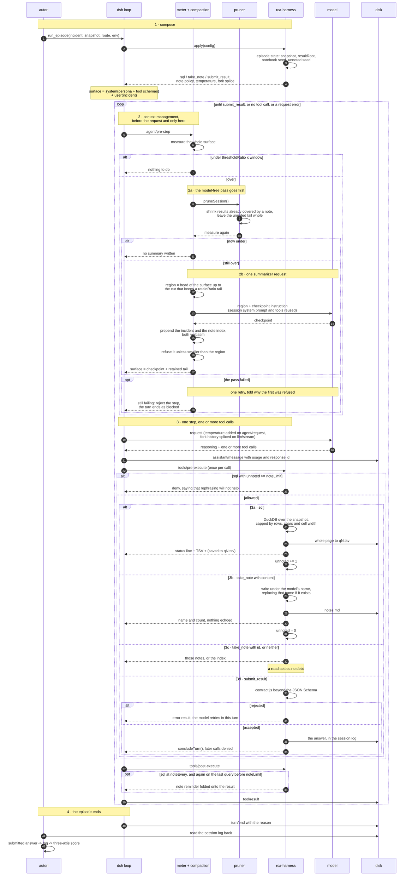

# The RCA harness

DeepSeek Harness (`dsh`) owns the agent loop. This directory owns what an RCA
episode needs on top of it: the action space, the answer channel, and context
management.

## One episode, end to end

The numbered markers in the diagram are the phases, and the sections below
carry the same numbers. The round badges are per-message, for pointing at one
arrow.

**1 · Compose.** `autorl.harness` picks the route and the environment the bundle
reads, and starts a runtime on `sdk-minimal` plus two patch layers: this
bundle's, which disables the shell and the editor and mounts the
context-management rows, and the scenario's, which carries the persona. `apply`
builds the episode state and registers everything the model can do. Nothing else
is reachable: the snapshot's answer files are not tables and DuckDB's own
readers are switched off.

**2 · Context management runs before the request, not after the result.** The
meter prices the whole surface — system prompt, tool schemas, every message.
Under the threshold nothing happens, which is the path most steps take.

**2a ·** Over it, the model-free pruner goes first and the surface is measured
again. An episode whose findings are in the notebook is usually back under the
threshold here, having spent no tokens.

**2b ·** Only when pruning is not enough is a checkpoint written, and that costs
a full model request. Two things are pinned to it rather than written by it. The
first is the incident: the region being replaced contains the episode's own
question, so the engine prepends that question verbatim and the template asks
for the state of the investigation only — a paraphrased task drifts pass after
pass, and the task is the one text that must not. The second is the notebook's
index, because a checkpoint cites the notes its claims rest on and every other
note would otherwise be unreachable by a model that cannot see it exists. The
index is a list of names with a cap, since it is the one part of a checkpoint
that grows with the episode. What the template does ask
for is where the investigation stands rather than a record of what it did — a record grows with the episode until the
checkpoint is the size of the region it replaces and a pass frees nothing. The
region is head-anchored: it starts at the first surface node, so the previous
checkpoint is always inside it and the new one replaces it rather than following
it. What survives verbatim is the tail, sized by `retainRatio`, cut back to
avoid splitting a tool call from its result.

The request asks for low reasoning effort where the routed model offers it: the
checkpoint is a template fill, and it is the thinking in front of it that fills
the output budget. Asking for an effort a route does not declare is a hard
error, so the effort is set only after the adapter says it exists.

A failed pass — a checkpoint refused for not being smaller than its region, one
the cap truncated, an endpoint error — leaves the surface untouched, so it is
retried once, and a checkpoint that was refused for its size is told so. If the
retry fails too the episode stops: the next step is rejected and the turn ends
as `blocked`. Continuing instead means sending a prompt the window cannot hold,
which reaches the endpoint as a bare error several steps later and costs the
whole episode anyway.

**3 · One step is one model turn.** The loop sends the request and the model
reasons and calls a tool — usually one, sometimes several at once, as when it
describes every table in a single turn. Each call goes through the harness
twice: on `tools/pre-execute`, where the note gate may deny `sql`, and on
`tools/post-execute`, where a reminder rides the result without costing a turn.
A parallel turn therefore spends the note budget several times over. The
reminder is sent twice in a debt cycle, on reaching `noteEvery` and on the last
query before the gate closes: it is a message the pruner cannot reach, so one
per query would spend more context than the results it protects. A `sql` result reaches the
model as TSV and reaches the disk whole (3a); a note write confirms with a name
and a count (3b); a note read hands back the notes asked for, or the index (3c).
Only a write settles the debt the pruner reads — clearing it on a read would
make an empty `take_note` a way around `noteLimit`. A submission is checked
twice, by the JSON Schema and then by `contract.js`, and a rejection is an
ordinary error the model can answer in the same turn (3d).

**4 · The episode ends** when `submit_result` is accepted, when the model stops
calling tools, or when a request fails. The trainer reads the session log back:
the accepted submission, parsed by `fpg`, scored against the annotation on
roots, subjects and edges.
